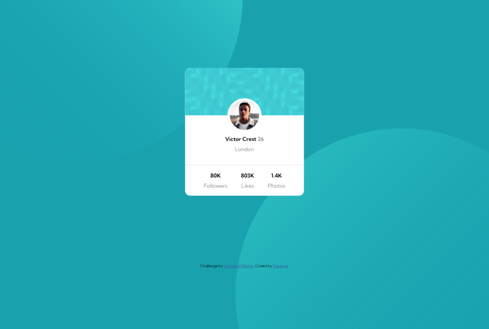

# Frontend Mentor - Profile card component solution

This is a solution to the
[Profile card component challenge on Frontend Mentor](https://www.frontendmentor.io/challenges/profile-card-component-cfArpWshJ).
Frontend Mentor challenges help you improve your coding skills by building realistic projects.

## Table of contents

- [Overview](#overview)
  - [Screenshot](#screenshot)
  - [Links](#links)
- [My process](#my-process)
  - [Built with](#built-with)
- [Author](#author)

## Overview

### The challenge

Users should be able to:

- View the optimal layout for the interface depending on their device's screen size
- See hover and focus states for all interactive elements on the page

### Screenshot

 

### Links

- Solution URL:
  [Frontend Mentor Solution](https://www.frontendmentor.io/solutions/resultsummarycomponent-htlmcss-and-js-CHyB__6VDX)
- Live Site URL: [Github Live](https://dgarance.github.io/results-summary-component-challenge/)

## My process

### Built with

- Semantic HTML5 markup
- CSS custom properties
- Flexbox
- Mobile-first workflow

## Author

- Github - [DGarance](https://github.com/DGarance)
- Frontend Mentor - [@DGarance](https://www.frontendmentor.io/profile/DGarance)
- Twitter - [@DGarance](https://twitter.com/Akane9721)
